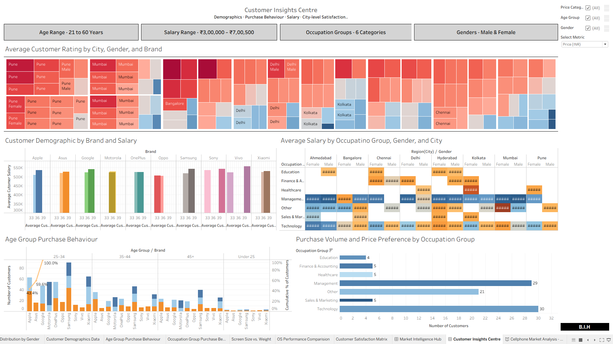
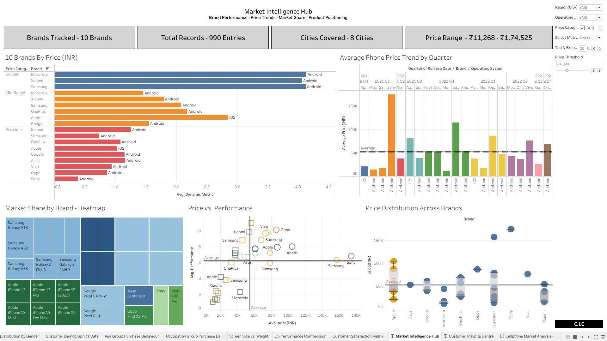

# Smartphone Market Analytics

**Statistical analysis in Python + interactive dashboards in Tableau**

Applied Learning Project, MBA Semester 3 (Data Science & Analytics), Jain Deemed-to-be-University, 2026.

**[Download the Tableau workbook (.twbx)](https://github.com/meshamanthadiga004/smartphone-market-analytics/blob/main/tableau/Tableau%20Workbook.twbx)** | **[Read the full report (PDF)](https://github.com/meshamanthadiga004/smartphone-market-analytics/blob/main/report/DSA_Business_Report.pdf)**





## Business question

A retailer ("Saap" in the case brief) wants to know what drives smartphone pricing, adoption and customer satisfaction: device specifications, or who is buying. This project answers that in two stages: hypothesis testing in Python, then a Tableau workbook built on the same findings.

## Dataset

990 records and 22 variables covering device specifications and buyer demographics. The data was provided as part of the coursework and is not included in this repository because it is not mine to redistribute. See [`data/README.md`](data/README.md) for the full data dictionary.

## Approach

1. **Cleaning and validation:** checked types, missing values, duplicates and inconsistent categories (Pandas, NumPy).
2. **Exploratory analysis:** distributions and relationships across product, pricing and demographic variables (Matplotlib, Seaborn).
3. **Hypothesis testing:** 18 tests (t-tests, ANOVA, chi-square) at a 95% confidence level (SciPy).
4. **Visualisation and reporting:** a Tableau workbook (2 dashboards, 15 worksheets, 12-point storyboard) and a 27-page report with business recommendations.

## Key findings

| # | Finding | Evidence |
|---|---------|----------|
| 1 | Brand is strongly associated with price. | ANOVA across brands: F = 105.69, p < 0.001 |
| 2 | OS separates the hardware tier. iOS and Android differ clearly on RAM and screen size, and brand and OS are closely linked. | RAM: F = 143.92. Screen size: F = 389.85. Brand vs OS chi-square: χ² ≈ 990, p < 0.001 |
| 3 | Demographics (age, gender, occupation) showed no significant effect on price category, brand or OS preference. | Not significant at the 95% level |
| 4 | Regional income differs. Mumbai salaries are significantly higher than Delhi's, which matches premium-tier representation by city. | p = 0.00024 |

**Business implication:** in this dataset, broad demographic targeting does not hold up, while specification- and brand-based targeting does.

**Limitations:** these tests show association, not causation. The data is a single coursework sample, so results may not generalise to the wider market. Statistical significance does not measure how large an effect is, so effect sizes should be read alongside the p-values.

The full test log is in the notebook and is summarised in the report.

## Repository structure

```
smartphone-market-analytics/
├── data/          Data dictionary (dataset not included)
├── notebooks/     Python analysis: cleaning, EDA, hypothesis testing
├── tableau/       .twbx workbook: 2 dashboards, 15 worksheets, storyboard
├── report/        Full write-up: methodology, findings, recommendations
├── requirements.txt
└── README.md
```

## Tools

Python (Pandas, NumPy, SciPy, Matplotlib, Seaborn), Jupyter Notebook, Tableau Desktop / Tableau Public.

## Reproducing the analysis

1. Place your own `cellphone_data.csv` in `notebooks/` (the notebook reads it from that folder), using the schema in `data/README.md`.
2. Install dependencies: `pip install -r requirements.txt`
3. Run the notebook: `jupyter notebook notebooks/`
4. Open `tableau/Tableau Workbook.twbx` in Tableau Desktop or Tableau Public.

## Status

Coursework project, submitted for MBA Semester 3. It is a snapshot of the analysis, not maintained production code.

## Author

**Shamanth Adiga Umesh**, MBA candidate in Data Science & Analytics, Bengaluru.
[LinkedIn](https://linkedin.com/in/shamanth-adiga-umesh-286b45214) | [GitHub](https://github.com/meshamanthadiga004)

## License

Released under the MIT License. See `LICENSE`.
